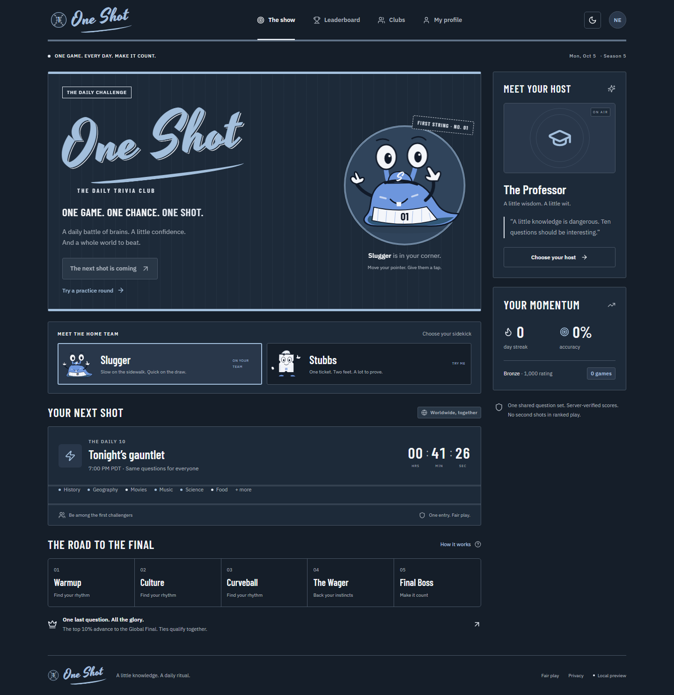

# One Shot

**One game. One chance. One shot.** A working daily trivia game with a React interface, persistent server engine, AI hosts, and an authenticated ChatGPT MCP plugin.



Vintage baseball lettering, cream pinstripes, navy blue, and faded red in light mode; midnight navy, powder blue, and white after dark. Choose Slugger, the curious blue slug in a pinstriped jersey, or Stubbs, the walking game-show ticket, under **Meet the home team**. Both follow your pointer, wave when tapped, and react to answers and theme changes. Motion respects your reduced-motion preference. See the [visual identity](docs/IDENTITY.md).

## Run it

Requires Node.js 24 or later. SQLite ships with Node; no separate database installation is needed.

```sh
npm ci
npm run build
npm start
```

Open **http://localhost:8787**. Practice works immediately. Create an account from **My profile** to enter ranked shows or create clubs. The server inherits an existing `OPENAI_API_KEY`; alternatively supply environment variables through ignored `.env.local`. Never commit credentials. Rebuild after frontend changes.

```sh
npm run check
npx playwright install chromium
npm run test:e2e
```

On Windows, set `PLAYWRIGHT_CHANNEL=chrome` in your shell to use an installed Chrome. CI installs its own browser. Automated suites use isolated databases and no API credits.

## Implemented features

| Area         | Behavior                                                                                        |
| ------------ | ----------------------------------------------------------------------------------------------- |
| Daily show   | Shared UTC appointment; ten questions, five rounds, timed reveals                               |
| Scoring      | Difficulty, speed buckets, streaks, confidence wagers, double-down, score floor                 |
| Global Final | Top 10% advance, inclusive of tied cutoff scores; one extra free-response question              |
| Practice     | Separate pool, repeatable, timed answers, excluded from ranked stats                            |
| Hosts        | Professor, Hype Man, Villain, Oracle; AI reactions and coaching, reliable fallbacks             |
| Identity     | Own player accounts; scrypt password hashes, HTTP-only cookies, OAuth/PKCE linking              |
| Social       | Private clubs, join links, club standings, mutual friend invitations, score-based rivals        |
| Profiles     | Accuracy, response time, day streak, category map, performance rating, tiers, achievements      |
| Boards       | Daily, rolling weekly/monthly, season, all-time, friends, club; pending correctness hidden      |
| Content      | Validated starter packs, AI drafting, private manual import/edit/review, frozen published packs |
| Interface    | ChatGPT/system, light and dark themes; mobile/desktop; keyboard shortcuts, reduced motion       |
| Integration  | 14 authenticated MCP tools, self-contained iframe, standard MCP Apps bridge, OAuth discovery    |
| Operations   | Persistent SQLite WAL, schema upgrades, health check, account deletion, Docker, GitHub CI       |

## Connect in ChatGPT

1. Deploy behind a public HTTPS origin with persistent disk; set `PUBLIC_URL` to that origin and `NODE_ENV=production`.
2. Run `npm run configure-plugin -- https://your-real-domain.example` to configure the package endpoint.
3. Add the HTTPS `/mcp` endpoint as a custom MCP plugin in ChatGPT with OAuth.
4. Create a One Shot account in the web app; sign in and authorize during linking. Prompt **“Open One Shot.”**
5. Verify the real ChatGPT widget and account linking before inviting players.

`plugin.json` and `mcp.json` use the portable Agent Plugins format. The checked-in endpoint is local development, **not** a public listing. Publication requires HTTPS hosting, real privacy/support information, test credentials, and platform review.

References: [MCP/UI quickstart](https://developers.openai.com/plugins/build/app-quickstart), [authentication](https://developers.openai.com/plugins/build/auth), [packaging](https://developers.openai.com/plugins/build/plugins).

## Schedule and content

Default: **02:00 UTC daily**, displayed in each player’s timezone (7 PM Pacific during daylight saving time; 6 PM during standard time). Configure `SHOW_HOUR_UTC` and `SHOW_MINUTE_UTC` for one shared worldwide appointment. Keep the schedule stable once games exist.

Production ranked play requires a private reviewed pack. Local ranked tests can use the two alternating public starter sets. These public answer keys are demonstration content and must not be used for serious competition.

Set a strong `ADMIN_TOKEN` on the server and in the operator’s environment. Generated drafts stay in ignored `data/drafts/`.

```sh
npm run content -- generate "Science and technology"
npm run content -- export <draft-id>
# Fact-check sources, hints and aliases; edit the private exported JSON.
npm run content -- update <draft-id> data/drafts/<draft-id>.json
npm run content -- publish <draft-id> 2026-10-07T02:00:00Z --reviewed
```

Use `import <private-file.json>` instead of AI generation; its shape is `{ "questions": [...] }`. Publish at least one hour before the configured appointment. Reviewed packs are immutable. Prepublish multiple days; the server never silently publishes unreviewed AI drafts.

See [.env.example](.env.example), [deployment](docs/DEPLOYMENT.md), [architecture](docs/ARCHITECTURE.md), [specification](ONE_SHOT_SPEC.md), and [validation](docs/VALIDATION.md).

Live AI verification returned `credit_balance_exhausted`. Fallback gameplay is verified; successful live AI output and draft generation require API credits and remain unverified. Credentials were neither printed nor committed.

This is a deployable single-instance pilot. It has not been publicly hosted or submitted to ChatGPT. Before broad release, add email verification/recovery, distributed persistence, moderation, durable abuse controls, observability and load testing. Ranked free-response scoring uses frozen accepted variants for reproducibility; live semantic AI judging, pairwise Elo, and championship tournaments remain future work.
